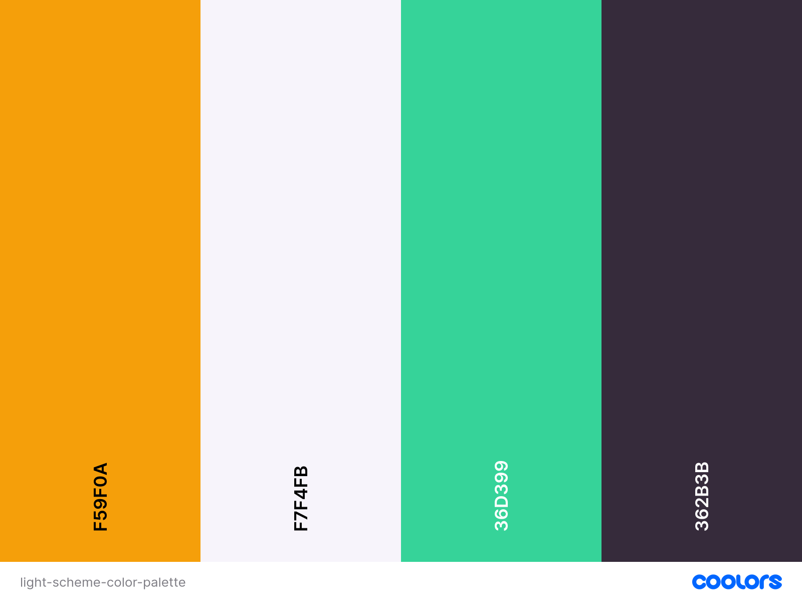

# QR Generator

## Access the Live Site

[Visit the live site here!](https://qrflow--qr-generator-2229d.europe-west4.hosted.app/)

---

## Table of Contents

1. [Project Goals](#project-goals)
2. [Target Audience](#target-audience)
3. [Design](#design)
   - [Color Scheme](#color-scheme)
   - [Typography](#typography)
4. [Features](#features)
   - [Existing Features](#existing-features)
   - [Future Implementations](#future-implementations)
5. [Technologies](#technologies)
6. [How It Works](#how-it-works)
7. [Premium Features](#premium-features)
8. [Pricing](#pricing)
9. [Payment Technology](#payment-technology)
10. [Deployment and Local Development](#deployment-and-local-development)
    - [Deployment](#deployment)
    - [Local Development](#local-development)
11. [Testing](#testing)
    - [Validation](#validation)
    - [Manual Testing](#manual-testing)
12. [Contributing](#contributing)
13. [Credits](#credits)
14. [Acknowledgements](#acknowledgements)

---

## Project Goals

The QR Generator project aims to provide users with a seamless way to create and customize QR codes for various purposes, such as marketing, personal use, or business needs. The application focuses on simplicity, speed, and customization options to cater to a wide range of users.

---

## Target Audience

- Small business owners looking to create QR codes for marketing materials.
- Individuals who want to generate QR codes for personal use.
- Developers and designers needing QR codes for projects.

---

## Design

### Color Scheme

The application uses a modern and clean color palette to ensure readability and visual appeal:

#### Light Mode



#### Dark Mode


### Typography

The project uses the 'Inter' font (sans-serif) for a modern and neutral look, suitable for both headlines and body text.

---

## Features

### Existing Features

- **Data Input**: Accept user input for URL, text, Wi-Fi credentials, contact information, and phone number.
- **QR Code Generation**: Generate QR code as a static image (PNG or SVG) based on the user-provided data. Users can set the desired pixel size and error correction level.
- **Download QR Code**: Provide a button to download the generated QR code image.


- **Responsive Design**: Fully functional on both desktop and mobile devices.

### Future Implementations

- **User Accounts**: Allow users to save and manage their QR codes.
- **Analytics**: Provide insights on QR code scans.
- **Batch Generation**: Generate multiple QR codes at once.

---

## Premium Features

Unlock additional functionality with our premium features:

- **Advanced Customization**: Access more design options, including gradient colors, custom logos, and unique patterns for QR codes.
- **High-Resolution Downloads**: Generate and download QR codes in ultra-high resolution for professional use.
- **AI-Powered Design Tool**: Incorporate a generative AI tool that provides design advice, such as optimal sizes and colors for readability and scannability based on user input and use case.


---

## Pricing

Our pricing plans are designed to suit a variety of needs:

- **Free Plan**:

  - Access to basic QR code generation features.
  - Limited customization options.
  - Standard resolution downloads.

- **Premium Plan**:
  - Includes all features from the Free Plan.
  - Advanced customization options, high-resolution downloads, and AI features.
  - Price: $4.99/month or $39.99/year.


---

## Payment Technology

To ensure secure and seamless transactions, we utilize the following payment technologies:

- **Stripe**:

  - Handles all payment processing, including subscriptions and one-time payments.
  - Ensures PCI compliance and secure handling of sensitive payment information.
  - Supports multiple payment methods, including credit cards, debit cards, and digital wallets like Apple Pay and Google Pay.

- **Encryption**:

  - All payment data is encrypted using industry-standard protocols to protect user information.

- **Fraud Detection**:
  - Integrated fraud detection tools to identify and prevent unauthorized transactions.

## Technologies

- **Next.js**: Framework for building the application.
- **Tailwind CSS**: For styling and responsive design.
- **TypeScript**: Ensures type safety and better code maintainability.
- **Jest**: For unit testing.
- **Firebase**: Backend services for authentication and database.

---

## How It Works

1. **Input Data**: Users can input various types of data, such as URLs, text, or Wi-Fi credentials, into the provided fields.
2. **Customize QR Code**: Adjust settings like pixel size, error correction level, and colors to match your needs.
3. **Generate and Preview**: Click the generate button to create a QR code and preview it in real-time.
4. **Download**: Save the QR code as a PNG or SVG file for use in your projects.
5. **AI Assistance**: Use the AI-powered design tool for suggestions on optimal QR code styles and configurations.

---

## Deployment and Local Development

### Deployment

1. Deploy the application using Vercel or any other hosting platform.
2. Ensure environment variables are configured for Firebase and other services.

### Local Development

1. Clone the repository:
   ```cmd
   git clone <repository-url>
   ```
2. Install dependencies:
   ```cmd
   npm install
   ```
3. Run the development server:
   ```cmd
   npm run dev
   ```
4. Open `http://localhost:3000` in your browser.

---

## Testing

### Validation

- **HTML**: Validated using W3C Validator.
- **CSS**: Validated using Jigsaw CSS Validator.
- **JavaScript/TypeScript**: Checked for errors using ESLint.

### Manual Testing

- Tested QR code generation with various input types (URL, text, Wi-Fi credentials, etc.).
- Verified customization options for colors, sizes, and error correction levels.
- Ensured responsiveness on desktop and mobile devices.

---

## Contributing

Contributions are welcome! To contribute:

1. Fork the repository.
2. Create a new branch for your feature or bug fix:
   ```cmd
   git checkout -b feature-name
   ```
3. Commit your changes:
   ```cmd
   git commit -m "Add feature description"
   ```
4. Push to your branch:
   ```cmd
   git push origin feature-name
   ```
5. Open a pull request and describe your changes.

---

## Credits

- **Libraries and Frameworks**: Next.js, Tailwind CSS, Firebase.
- **Icons and Images**: Simple, geometric icons for different input types (URL, text, Wi-Fi).
